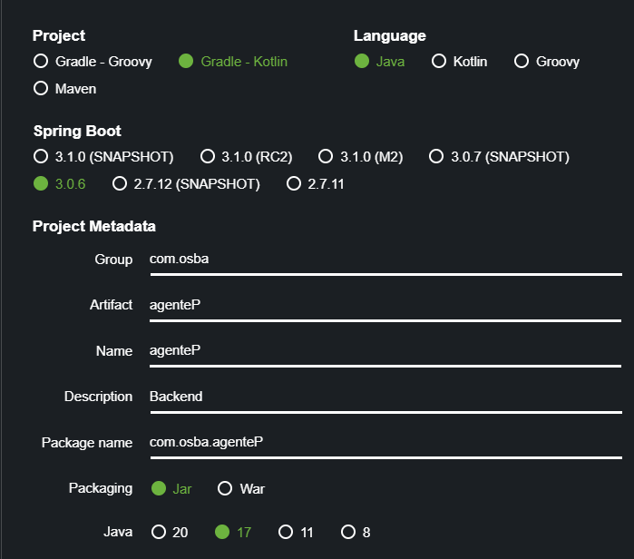

# backend
## Configuracion



| Cosa      | Version |
|-----------|---------|
| Java      | 17      |
| SpringBoot| 3.0.6   |

Los datos de conexion de la base de datos se encuentra en el archivo `/src/main/resources/application.properties`,


## Para entender SpringBoot
Necesitan leer 
- JPA
    - Entity
    - JpaRepository

## Login

- Se puede iniciar sesion con rfc o nss o id o correo.
- Se utiliza una contraseña
- La contraseña se almacena encriptada usando el algoritmo sha-256

- si el usuario existe y la contraseña es la misma retornar un token de sesion. (este va a servir para identificar en los otros endpoints)
## Como generar el token de sesion?

- un string de secreto (Va a estar guardado en un .env)
- un timestamp del cual solo nos interesará el dia.
- un id de usuario

Ejemplo de creacion del token con js y CryptoJS
```js
generarToken = (id) => {
    //Lee el secreto de las variables de entorno
    const secreto = process.env.SECRET;
    // Obtiene el tiempo actual en milisegundos
  const time = Date.now();
    // Convierte el tiempo a una fecha legible (dia/mes/año)
  const today = new Date(time).toLocaleDateString();
    // Encripta el id y el tiempo usando el secreto y lo retorna
  return CryptoJS.AES.encrypt(`${id}/${today}`, secreto);
};

```
Ejemplo para obtener el id desde el token
```js
getIdFromToken = (token) => {
    const secreto = process.env.SECRET;
    // se desencripta el token (se generan bytes)
    const bytes = CryptoJS.AES.decrypt(token, secreto);
// se convierten los bytes a texto
    const originalText = bytes.toString(CryptoJS.enc.Utf8);
// separamos el id del tiempo
    const [id,time] = originalText.split("/");

// se busca el id en la base de datos
    idInDatabase = buscarIdEnBaseDeDatos(id);

// si la base de datos no tiene el id, retornamos null, si la tiene retornamos el id
    if(idInDatabase){
        return id;
    }
    return null;
    };
```

var encrypted = CryptoJS.AES.encrypt("This is my secret message", "EncryptionKey");
var decrypted = CryptoJS.AES.decrypt(encrypted, "EncryptionKey");


## Registro
- recibira todos los datos del empleado
- se guardara la contraseña encriptada con sha-256 (frontend ya lo envia así)
- se guardara el empleado en la base de datos
- se retornara un token de sesion
- calcular la fecha de ingreso del empleado

## Registro de asistencia
- Recibe el rfc, nss, id o correo del empleado y la contraseña
    - si el usuario existe y la contraseña es la misma
        
        - buscar si hay un registro de asistencia para el dia de hoy y el tipo
            - si el tipo del registro de asistencia  es entrada, se registra la salida y si es de salida se registra la entrada

        - si no hay registro de asistencia para el dia de hoy se crea un registro de asistencia con el tipo entrada

        - retorna el estado de exito y el tipo de registro de asistencia
    - si no existe el usuario retorna un estado de error

## Buscar cliente
Se buscara por rfc, nombre y correo a un externo de tipo cliente.

Retorna todos sus datos

## Agregar venta
Se crea una venta con los siguientes datos

- id lugar
- id empleado
- fecha


## Agregar concepto
Recibira los siguientes datos
- id de articulo
- cantidad
- id lugar
- tipo movimiento
- id movimiento 

1. Se busca el registro con la caducidad más proxima en inventario (usas id lugar para esto)
2. Se verifica si nos alcanza
3. si no nos alcanza:
    - se resta a cantidad la cantidad que este en inventario
    - Se crea el concepto con la cantidad de este inventario 
    - se regresa al paso 1 con la nueva cantidad


4. Si nos alcanza sSe crea el concepto

5. Se regresan los conceptos

> para crear el concepto se calcula el precio unitario en base a precio bace, porcentaje ieps y porcentaje ganancia

> Tambien se calcula el monto, multiplicanto el precio unitario por la cantidad


## update venta cuando se finaliza la venta
recibe meto de pago y id de cliente

- Se actualiza metodo de pago
- Se registra al cliente

> Trigers: subtotal, total, iva, cantidad conceptos


